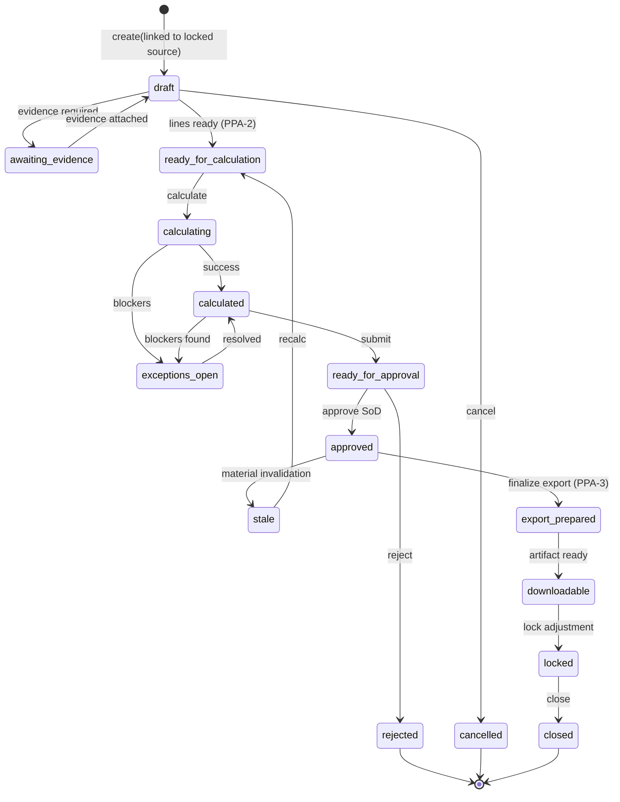

# Wave 6 / M07 — Prior-Period Adjustment (PPA) Implementation Plan

**Document type:** Implementation planning only — **does not authorise implementation**  
**Created:** 30 July 2026  
**Planning baseline HEAD:** `79e6b10dc247fd0593e4fbc71565c237abba865a`  
**Accepted Batch 6 technical target:** `ce1f4af68917c9988efff327d521d94b8289f2fc`  
**Batch 6 owner-acceptance evidence:** `ad54aed94b0c798d3f26fe66bf811d6e3b083151`  
**Readiness/design input:** `docs/plans/WAVE6_M07_PPA_READINESS_AND_DESIGN.md` (planning input only; not implementation authority)  
**Status:** **NOT owner-approved** — awaiting owner decisions and express batch authorisation  

**Non-claims:** Not owner approval to implement. Not production deployment. Not statutory or monetary correctness. Not payment readiness. Not provider-return support. Not Module 8. Not full repository TypeScript/build health.

---

## A. Baseline verification

| Check | Result |
|---|---|
| Branch | `main` |
| HEAD (pre-commit) | `79e6b10dc247fd0593e4fbc71565c237abba865a` |
| `origin/main` | Identical |
| Ahead/behind | `0/0` |
| Working tree | Clean |
| Batches 1–6 | Owner accepted and closed (Batch 6 with qualifications) — `.cursor/rules/hcdp-wave-control.mdc`, `docs/audits/WAVE6_BATCH6_*` |
| PPA | Planned only; not implemented; not authorised |
| Post–Batch-6 M07 / M08 implementation | None present (no `PriorPeriodAdjustment` / `ppa-service` production paths) |

---

## B. Repository sources inspected

### Architecture / plans / control

- `docs/plans/WAVE6_M07_PPA_READINESS_AND_DESIGN.md`
- `docs/architecture/WAVE6_M07_IMPLEMENTATION_PLAN.md` (esp. Q6, §13)
- `docs/architecture/WAVE6_M07_INTEGRATION_BOUNDARY_MAP.md` (§3A, §9)
- `docs/architecture/WAVE6_M07_WORKFLOW_CATALOGUE.md` (WF-33)
- `docs/architecture/WAVE6_M07_PERMISSIONS_MATRIX.md`
- `docs/architecture/WAVE6_M07_SCREEN_ACTION_MATRIX.md`
- `docs/architecture/HCDP_PROTOTYPE_PARITY_REGISTER.md`
- `.cursor/rules/hcdp-wave-control.mdc`

### Evidence

- `docs/audits/WAVE6_BATCH6_CHECKPOINT_6_1_6_2_EVIDENCE.md`
- `docs/audits/WAVE6_BATCH6_CHECKPOINT_6_3_6_4_EVIDENCE.md`
- `docs/audits/WAVE6_BATCH6_CHECKPOINT_6_5_6_6_EVIDENCE.md`
- `docs/audits/WAVE6_BATCH6_REQUIREMENT_TRACEABILITY.md`
- Batch 1–5 evidence trees under `docs/audits/WAVE6_BATCH*`

### Production (confirmed current behaviour)

- Domain: `src/modules/m07-staff-pay/types/domain.ts` (`PayPeriodKind`, lifecycle, lock/unlock, export, recon)
- Periods: `services/period-service.ts` (ordinary-only create)
- Lock/guard/unlock: `period-lock-service.ts`, `period-lock-guard.ts`, `period-unlock-service.ts`
- Calc/approval/export/recon: `calculate-service.ts`, `approval-service.ts`, `approval-invalidation.ts`, `export-*.ts`, `reconciliation-service.ts`
- Permissions: `permissions.ts`
- UI: `section-meta.ts` (`adjustments` = planned), `sections/PlannedSection.tsx`, `sections/ExportSection.tsx`
- Storage: `storage/keys.ts` (`adjustments` key reserved; no PPA writer)
- Adapters: `adapters/m02-inbox-publish.ts`, `m04-*`, `m05-roster-read.ts`, `m06-timesheet-read.ts`
- Platform: `src/platform/workforce/contracts/pay-period-ref.ts`, published-timesheet contracts/registry

### Tests (exist; cite for regression)

- `src/modules/m07-staff-pay/tests/m07-batch6-*.test.ts`, `m07-batch5-*.test.ts`, boundary/architecture/authz/intake/replay suites

**Legend used below:** confirmed production | accepted qualified | planning proposal | absent | deferred | unrelated debt

---

## C. PPA definition and boundary

### C.1 Authoritative definition

**PPA = Prior-Period Adjustment:** a controlled correction relating to a previously processed/closed (typically **locked**, usually exported) ordinary payroll period, where the **original period remains historically immutable**.

Confirmed by: Wave 6 plan Q6/§13; integration map §3A; WF-33; Batch 6 exclusions; wave-control rule; readiness design §B.

### C.2 Recommended default boundary (evaluated against repo)

| Element | Verdict |
|---|---|
| Created in an authorised **current adjustment context** | **Adopt** — use `PayPeriodKind = "adjustment"` (type already exists; create path absent) |
| References affected prior period + authoritative sources | **Adopt** — required pins per §13 |
| Records reason and correction type | **Adopt** |
| Preserves original prior-period snapshot/result | **Adopt** — lock guard already blocks ordinary mutation |
| Calculates/records only authorised **delta** | **Adopt** in PPA-2+; not in first batch |
| Review, exceptions, approval | **Adopt** in later batches; reuse Batch 5 patterns |
| Provider-neutral adjustment output | **Adopt** in PPA-3; reuse Batch 6 export |
| Complete audit/revision trail | **Adopt** from PPA-1 |
| No silent rewrite of original period | **Mandatory** |
| Not ordinary unlock/recalculate | **Mandatory** — unlock ≠ PPA (Batch 6 + ExportSection copy) |
| No payment / statutory submission | **Mandatory** exclusion |

**No OWNER APPROVAL REQUIRED** to adopt this boundary — it matches repository decisions. Redefining PPA as ordinary payroll preparation **would** require owner approval (rejected by readiness Q1 / wave-control).

### C.3 Start / end

- **Starts when** a locked (and preferably exported/reconciled) ordinary period needs correction without rewriting it.  
- **Ends when** an auditable, versioned, optionally exportable **preparation** adjustment package exists.  
- **Does not end in** money movement, STP, super, bank files, provider-return parsing, Xero production, or M08.

---

## D. PPA versus preparation, recalculation and unlock

| Dimension | Ordinary prep (B1–6) | Recalc before lock | Unlock/reopen (B6) | **PPA** | Provider-return correction | Payment correction |
|---|---|---|---|---|---|---|
| Purpose | Prepare period for export | Refresh open calc | Exceptional remediation | Correct **after** lock/export without rewrite | Match external provider files | Fix disbursement |
| Trigger | Cadence / open period | Input/rule change while open | Controls-incomplete unlock | Authorised correction need | External return file | Bank/pay failure |
| Source period | Current ordinary | Same ordinary | Same ordinary | **Prior locked ordinary** | Prior export | Prior payment |
| Destination | Same period | Same period | Same period reopened | **New adjustment context** | Recon / future | Outside M07 |
| Original immutability | N/A until lock | Lines supersede within open | Reopens mutability | **Source stays immutable** | Package history kept | Outside |
| Calculation | Full prep lines | New calc version | May recalc after open | **Delta lines** (later batches) | Deferred | Excluded |
| Approval | Management approve | Re-approve if stale | Stale on unlock path | PPA approval (later) | Deferred | Excluded |
| Lock | Explicit lock | N/A | Unlocks | Source remains locked; adjustment may lock later | — | — |
| Export | Canonical package | Refresh before finalize | May supersede export | Adjustment package (later) | Deferred | Excluded |
| Audit | Full | Full | Unlock + controls | Full linkage pins | Deferred | Excluded |
| Permissions | period/calc/approve/export | calculate | unlock.request/approve | `payroll.adjust` (+ later reuse) | — | — |
| Recovery | Exceptions/waive | Recalc | Retry unlock controls | New PPA / cancel draft | Deferred | Excluded |
| Inside first PPA? | Base to preserve | Outside PPA | **Outside PPA** (must not auto-create PPA) | **Yes** | **Deferred** | **Excluded** |

---

## E. Trigger catalogue

| Trigger | First PPA scope? | Authoritative source | Affected prior data | Correction | Evidence | Sign | Emp. approve | Period approve | Payroll/legal | Audit | M02 | Defer reason |
|---|---|---|---|---|---|---|---|---|---|---|---|---|
| Late approved timesheet | **PPA-2+** (capture ref in PPA-1 as source attachment optional) | M06 TimesheetRef | Hours/allowances | Delta hours/amounts | Publication id + version | ± | No (M06 approved) | Yes (PPA) | If disputed | `ppa.source.attach` | optional | Calc in PPA-2 |
| Timesheet corrected after closure | PPA-2+ | M06 supersession | Prior snapshot vs new | Delta | Both revisions | ± | No | Yes | If disputed | pins | optional | — |
| Classification correction | PPA-2+ | M04 + M07 map | Rule binding | Delta via rule | Map/rule versions | ± | No | Yes | Possibly | pins | — | Rule interpretation unresolved |
| Effective-dated rate correction | PPA-2+ | M07 profile | Rate lines | Delta | Profile version + dates | ± | No | Yes | Possibly | pins | — | Gregorian dates fail closed |
| Allowance correction | PPA-2+ | Codes + snapshot | Allowance lines | Delta | Code version | ± | No | Yes | — | pins | — | — |
| Leave correction | PPA-2+ | M04 leave | Leave prep | Delta | Leave id+version | ± | No | Yes | Possibly | pins | — | — |
| Deduction correction | PPA-2+ | M07 deduction inputs | Deduction lines | Delta | Input version | ± | No | Yes | — | pins | — | — |
| Prep-rule correction | PPA-2+ | M07 rules | Multipliers | Delta | Rule version | ± | No | Yes | **Yes if award claim** | pins | — | Non-certified only |
| External payroll employee ID | PPA-1 metadata / PPA-3 export gate | M07 profile | Export identity | Relink audited; may need PPA if exported identity wrong | ID history | n/a | No | Yes if export | — | existing link audit | — | Identity vs amount |
| Export mapping correction | PPA-3+ | Export profile | Package shape | New adjustment export | Profile version | n/a | No | Yes | — | export audit | — | Mutation-side lock qual |
| **Manual authorised correction** | **PPA-1 create + PPA-2 lines** | Actor + reason | Declared | Manual delta | Reason + note | ± (owner Q) | No | Yes | If material | `ppa.create` | optional | — |
| Provider-return discrepancy | **Deferred** | External file | Package lines | Deferred | — | — | — | — | — | — | — | OUT provider-return |
| Payment failure | **Excluded** | Bank/provider | Payment | Excluded | — | — | — | — | — | — | — | OUT payment |
| Statutory correction | **Deferred/excluded** | ATO/STP/etc. | Tax/super | Excluded | — | — | — | — | **Required adviser** | — | — | OUT STP/super |

---

## F. Current capability and gap matrix

| Capability | Status | Path | Contract | Permission | Guard | Audit | Tests | Evidence | Gap | PPA need | Batch | Verdict |
|---|---|---|---|---|---|---|---|---|---|---|---|---|
| Period lifecycle ordinary | implemented and production-wired | `period-service.ts` | `pay-period-ref` | period.create/edit | one-open ordinary | yes | domain/authz | B1+ | — | preserve | — | base |
| `kind=adjustment` period | partial | `domain.ts` type only | — | — | — | — | — | plan | no create API | create linked PPA period | **PPA-1** | build |
| Calculation ordinary | implemented and production-wired | `calculate-service.ts` | — | calculate | not locked | yes | B3 | B3 | — | pattern reuse | PPA-2 | base |
| Recalculation open | implemented and production-wired | calculate-service | — | calculate | lock denies | yes | B3–6 | B3–6 | — | never on locked source | — | base |
| Approval + invalidation | implemented and production-wired | approval-*, invalidation | M02 | approve/submit | SoD | yes | B5 | B5 | — | reuse on adjustment | PPA-3 | base |
| Locking | implemented and production-wired | period-lock-service | — | period.lock | recon+approval | yes | B6 | B6 | — | source must be locked | PPA-1 | base |
| Unlocking | implemented but qualified | period-unlock-service | M02 | unlock.* | controls-incomplete | yes | B6 rem | B6 | ≠ PPA | must not auto-PPA | — | qualified |
| Timesheet intake/replay | implemented and production-wired | published-timesheet-* | TimesheetRef | intake | lock-before-append | yes | B2 | B2 | — | no duplicate into locked | PPA-1 guard | base |
| Source revisions | implemented and production-wired | snapshots/lifecycle | hash/events | — | supersession | yes | B2 | B2 | — | pin on PPA | PPA-1/2 | base |
| Workforce data | implemented and production-wired | m04 adapters | person/engagement refs | — | doctor exclude | — | B2–5 | B2–5 | no dual write | reference only | all | base |
| Pay profiles / rates | implemented and production-wired | profile-service | — | profile/rate | lock + Gregorian dates | yes | B5–6 rem4 | B6 | — | pin versions | PPA-2 | base |
| Effective-date validation | implemented and production-wired | `isCanonicalCalendarDate` | — | — | fail closed | — | rem4 | B6 | — | mandatory on PPA dates | PPA-1+ | base |
| Allowances/leave/deductions | implemented and production-wired | leave/code/deduction services | M04 leave | adjust/codes | lock | yes | B4 | B4 | — | delta categories | PPA-2 | base |
| Exceptions | implemented and production-wired | exception-service | M02 | exception.* | waive matrix | yes | B4 | B4 | — | PPA exception kinds | PPA-2 | base |
| Export profiles/batches/download/checksum | implemented but qualified | export-* | canonical-export-v1 | export.* | mutation-side `*` | yes | B6 | B6 | download-before-lock | reuse for adj. | PPA-3 | qualified |
| Package recon | implemented but qualified | reconciliation-service | — | export.reconcile | independent expected | yes | B6 | B6 | not provider return | optional adj. recon | PPA-4 | qualified |
| Audit | implemented and production-wired | audit-service | — | audit.view | fail-closed hooks | yes | B6 | B6 | non-tx w/ M02 | ppa.* actions | PPA-1 | qualified |
| M02 | implemented but qualified | m02-inbox-publish | action-inbox-bridge | — | sequenced | paired | B6 | B6 | non-tx | optional PPA blockers | inherit | qualified |
| LE/tenant isolation | implemented and production-wired | permissions asserts | M03 scope | all | fail closed | yes | matrix | all | — | same | all | base |
| Prior-period correction | absent | — | — | adjust (unused for PPA) | — | — | none | deferred B6 | full subsystem | core | **PPA-1…** | build |
| Immutable adjustment history | absent | adjustments key empty | — | — | — | — | — | — | no writer | history entries | PPA-1 | build |
| Adjustment reversal | absent | — | — | — | — | — | — | — | — | reverse via new PPA | PPA-2+ | later |
| Adjustment export | absent | — | — | — | — | — | — | — | — | canonical delta package | PPA-3 | later |
| Payment/STP/super/bank/Xero/M08 | deliberately deferred / outside M07 | prohibited fields | — | — | reject | — | arch tests | OUT | — | never in PPA batches | — | excluded |

---

## G. Data ownership and immutability

| Item | Owner | ID | Tenant/LE | Source rev | Effective dates | PPA stores | Immutability | Recalc | Lock | Audit | Failure |
|---|---|---|---|---|---|---|---|---|---|---|---|
| Adjustment case | M07 | adjustmentId | LE = source LE | — | createdAt | SoT | draft mutable; approved immutable fields | — | — | create/update | reject pre-write |
| Reason | M07 | reasonCode + text | LE | — | — | SoT | after submit locked | — | — | yes | missing reason deny |
| Affected prior period | M07 | sourcePeriodId | LE | period.version | periodStart/End | **reference** | source immutable | never rewrite | must be locked | pin | not locked → deny |
| Adjustment period | M07 | adjustmentPeriodId `kind=adjustment` | same LE | version | PPA window | SoT | per state machine | PPA-only | may lock later | yes | coexistence fail |
| Workforce person | M04 | personId | org/LE | M04 | employment | reference | no M04 write | — | — | — | missing/doctor deny |
| Employment/classification | M04 + M07 map | engagement/class/map ids | LE | versions | map effective | pin versions | — | — | — | — | unresolved → exception |
| Original timesheet | M06 | registryPublicationId | org/LE | sourceVersion | period | reference + optional attach | no re-intake into locked | — | blocks intake | pins | duplicate deny |
| Corrected timesheet | M06 | newer publication | org/LE | newer version | — | reference | — | drives delta | — | pins | — |
| Original calculation | M07 | calc batch id | LE | calc version | — | pin | immutable | — | — | yes | missing pin deny |
| Delta lines | M07 | line id | LE | calcRev | line dates | SoT derived | versioned | PPA recalc | — | yes | invalid date deny |
| Rates/allowances/rules/profile | M07 | profile/rule/code ids | LE | versions | Gregorian effective | pins | — | material → stale | mutation guard | yes | fail closed |
| Export profile/batch | M07 | profileId/batchId | LE/`*` | versions/checksum | — | pin on export | finalize immutable | — | mutation-side | yes | Batch 6 quals |
| Approvals/locks/unlocks | M07 | ids | LE | — | — | refs | unlock ≠ PPA | — | source lock stays | yes | — |
| M02 refs | M07→M02 | correlation keys | — | — | — | projection ids | — | — | — | paired | non-tx qual |
| Money/bank/STP/super | forbidden | — | — | — | — | **never** | — | — | — | reject | outside |

**Forbidden:** dual ownership, dual write, cross-module repository imports, caller-widened scope, silent historical mutation.

---

## H. Proposed domain model

Reuse existing where possible; add minimum new SoT.

### H.1 Extend existing

| Existing | Use |
|---|---|
| `PayPeriodRecord` + `kind: "adjustment"` | Adjustment-period container (create API new) |
| `PayPrepLine` / calculation batch patterns | Delta lines in PPA-2 (category + signed quantity/amount) |
| `PayPrepException` | PPA-scoped kinds in PPA-2 |
| `PayPeriodApproval` | Approve adjustment period in PPA-3 |
| `PayrollExportBatch` | Export adjustment packages in PPA-3 |
| `M07AuditEvent` | `ppa.*` actions from PPA-1 |
| Storage key `adjustments` | Persist adjustment **cases** (currently unused) |

### H.2 New minimum entity: `PriorPeriodAdjustment` (case)

| Field | Spec |
|---|---|
| Purpose | Authoritative PPA case linking locked source → adjustment period |
| id | `ppa_<ulid>` |
| legalEntityId / organisationId | = source period LE (authoritative from store) |
| sourcePeriodId | locked ordinary period |
| adjustmentPeriodId | `kind=adjustment` period |
| status | see state machine |
| reasonCode / reasonText | mandatory |
| correctionType | e.g. `manual` \| `timesheet` \| `rate` \| `leave` \| … (expand PPA-2) |
| sourceCalculationVersion / sourceExportVersion / sourceManifestChecksum / sourceExportChecksum | required pins at create |
| sourceApprovalId / sourceLockId | required refs |
| affectedPersonIds[] | optional at create; required before calc |
| idempotencyKey | `(legalEntityId, sourcePeriodId, open)` or client key |
| version | optimistic concurrency |
| createdAt/By, updatedAt/By | actors |
| Immutability | pins immutable after create; reason immutable after submit |
| Retention | same as M07 audit/export retention policy |
| Audit | `ppa.create`, `ppa.cancel`, … |

### H.3 Deferred entities (not first batch)

- `AdjustmentLine` / `AdjustmentCalculationRevision` → PPA-2  
- `AdjustmentException` → extend PayPrepException  
- `AdjustmentApproval` → reuse PayPeriodApproval on adjustment period  
- `AdjustmentExportReference` → export batch meta  
- `AdjustmentHistoryEntry` → audit stream sufficient initially  

**Do not invent** separate workforce/timesheet ownership models.

---

## I. State machine

### I.1 Recommended states (minimal)

| State | Entry | Allowed | Prohibited | Role | Permission | Guard | Exit | Invalidation | Audit | M02 | Recovery | Idempotency |
|---|---|---|---|---|---|---|---|---|---|---|---|---|
| `draft` | create OK | edit reason (limited), cancel, attach source refs | calculate/approve/export | clerk/admin | adjust | source locked; pins present | ready_for_lines / cancelled | — | ppa.create | optional | cancel | create key |
| `awaiting_evidence` | missing optional evidence policy | attach evidence | approve/export | clerk | adjust | — | draft/ready | — | ppa.evidence | — | attach | attach key |
| `ready_for_calculation` | lines policy met (PPA-2) | calculate | export | clerk | calculate+adjust | open adjustment period | calculating/calculated | source pin break → cancel/freeze | — | — | — | — |
| `calculating` / `calculated` | calc start/end | view; submit | mutate source | clerk | calculate | — | exceptions / ready_for_approval | material change → stale | ppa.calculate | — | recalc | calc rev |
| `exceptions_open` | blockers | resolve/waive | approve | clerk/approver | exception.* | waive matrix | calculated | — | exception.* | assign | resolve | — |
| `ready_for_approval` / `approved` | submit/approve | approve/reject | edit lines | SoD | review.submit / approve | SoD | export_prepared / rejected | material → stale | approval.* | inbox | re-submit | approval id |
| `stale` | invalidation | recalc/re-approve | export finalize | — | — | — | calculated | — | invalidate | — | recalc | — |
| `export_prepared` / `downloadable` | finalize | download | edit | export ops | export.* | checksum | locked_adj / closed | profile stale | export.* | export | supersede package | batch id |
| `locked` (adjustment) | lock adj period | view | mutate | approver/admin | period.lock | recon if required | closed | — | lock | — | further PPA | — |
| `rejected` / `cancelled` | reject/cancel | view | further mutate | approver/clerk | approve/adjust | draft/in-review only for cancel | terminal | — | yes | — | new PPA | — |
| `closed` | policy complete | view | all mutate | admin | — | — | — | — | close | — | — | — |

PPA-1 implements **`draft` / `cancelled` / terminal view** only (create, list, cancel, pin capture). Later states activate with later batches.

### I.2 Transition table (PPA-1 subset)

```text
(none) --create--> draft
draft --cancel--> cancelled
draft --(future attach/calc)--> …  [PPA-2+]
```

### I.3 Mermaid



---

## J. Calculation and delta design

### J.1 Representation (PPA-2+)

- Preserve original calc + export pins.  
- Each correction = signed **delta line** (hours/units and/or preparation amount).  
- Fields: `originalRef`, `originalQuantity/Amount`, `correctedQuantity/Amount`, `deltaQuantity/Amount`, category, personId, rule/profile/code versions, source timesheet refs.  
- Zero delta → reject or no-op (fail closed if claimed material).  
- Multiple corrections to same source revision → **deny duplicate** unless prior delta superseded/reversed by new PPA.  
- Reversal → new PPA with opposite deltas referencing prior adjustmentId.  
- Rounding: reuse `export-decimal` scale-100 patterns.  

### J.2 Excluded from calculation claims

Tax, executable net-pay, super processing, employer cost engines beyond prep, award certification, payment.

### J.3 Unresolved rules (fail closed; owner/adviser)

- Which over/underpayments require employee notification  
- Whether negative gross packages permitted in export  
- Award/EA interpretation for classification/rate disputes  
- Accounting period to which deltas post externally  

Do **not** invent statutory rules in implementation.

---

## K. Fail-closed controls

| Condition | Stage | Error code (proposed) | User explanation | Service | Pre-write | Atomicity | Audit | M02 | Retry | Recovery | Test |
|---|---|---|---|---|---|---|---|---|---|---|---|
| Missing LE/tenant / cross-entity | create | `missing-legal-entity-context` / scope deny | Out of scope | throw | yes | N/A | deny | — | no | fix actor | authz |
| Missing person | line/calc | `missing-person-context` | Person required | throw | yes | — | yes | — | — | fix M04 | service |
| Missing external ID | export | `missing-external-payroll-employee-id` | ID required | block | yes | — | yes | blocker | — | link ID | B6 reuse |
| Missing/unlocked source period | create | `source-not-locked` | Source must be locked | throw | yes | — | deny | — | no | lock first or deny | **PPA-1** |
| Invalid/impossible date | any date field | `invalid-effective-date` | Invalid calendar date | throw | yes | — | deny | — | no | correct | rem4 pattern |
| Missing reason | create | `missing-ppa-reason` | Reason required | throw | yes | — | deny | — | no | supply | **PPA-1** |
| Missing pins (calc/export/lock) | create | `missing-source-pins` | Cannot bind history | throw | yes | — | deny | — | no | ensure source exported/locked | **PPA-1** |
| Duplicate open PPA | create | `duplicate-open-ppa` | Open PPA exists | conflict | yes | — | deny | — | idempotent return | close/cancel prior | **PPA-1** |
| Duplicate ordinary intake to locked | intake | existing lock codes | Denied | reject | yes | — | yes | — | — | use PPA | regression |
| Classification/rate/code issues | calc | existing + ppa variants | Blocked | exception | yes | — | yes | optional | — | fix/waive | PPA-2 |
| Unapproved / changed timesheet | attach/calc | `source-revision-mismatch` | Revision changed | reject | yes | — | yes | optional | — | new attach | PPA-2 |
| Stale calc/approval | approve/export | `stale-approval` | Re-approve | deny | yes | — | yes | — | — | recalc | PPA-3 |
| Export profile locked impact | profile mutate | `period-locked-source-change` | Locked impact | reject | yes | — | yes | stale | — | unlock≠PPA | B6 |
| Partial audit/M02 | control paths | `locked-source-control-incomplete` pattern | Controls incomplete | fail closed | — | **not** stronger than B6 | partial possible | partial | retry | retry | qual |
| Repo write failure | any | storage error | Failed | no success audit | — | no partial success claim | — | — | retry | retry | **PPA-1** |
| Locked source mutation | ordinary mutate | existing | Use PPA | reject | yes | — | yes | yes | — | create PPA | B6 |

**Reject-after-write is blocking** unless transactional rollback is proven — PPA-1 must validate then write case+period atomically within local-store transaction boundaries available, or write case only after period create succeeds with compensating cancel (document explicitly in implementation).

---

## L. Permissions and segregation of duties

### L.1 Existing (reuse)

`payroll.adjust`, `payroll.view`, `payroll.calculate`, `payroll.review.submit`, `payroll.approve`, `payroll.export.*`, `payroll.period.lock`, `payroll.exception.*`, `payroll.audit.view`, unlock codes (not for PPA create).

### L.2 Minimum recommendation

| Action | Permission | Note |
|---|---|---|
| View/list/create/cancel draft PPA | `payroll.adjust` | **Recommended** reuse; distinct audit `ppa.*` |
| Calculate PPA | `payroll.calculate` + adjust | PPA-2 |
| Approve PPA | `payroll.approve` + SoD | PPA-3; no new code initially |
| Export PPA | `payroll.export.create/download` | PPA-3 |
| New `payroll.ppa.*` codes | **Not** in PPA-1 | Revisit if SoD conflicts |

### L.3 SoD

- UI visibility ≠ authorisation; service asserts mandatory.  
- Submitter/calculator ≠ sole final approver (existing SoD) on adjustment periods.  
- Export operator cannot approve or lock.  
- Authoritative LE from source period store — ignore widened caller metadata.  
- Dual approval: **not** required for PPA-1 draft create; reassess for material negative deltas (owner).

---

## M. Audit, history, idempotency and atomicity

| Command | Idempotency key | Precondition | Atomic boundary | Writes | Audit | Event/M02 | Retry | Partial failure |
|---|---|---|---|---|---|---|---|---|
| create PPA | client key or `(LE, sourcePeriodId, open)` | source locked+pins | case + adjustment period | adjustments + periods | `ppa.create` | optional | return existing open | no orphan period without case |
| cancel draft | adjustmentId+version | draft | status cancel | case+period | `ppa.cancel` | — | idempotent | — |
| attach source (PPA-2) | attachment key | draft | case update | case | `ppa.source.attach` | — | — | — |
| calculate (PPA-2) | calcRev input hash | open adj | calc batch + lines | calcs | `ppa.calculate` | — | new rev if changed | no approve |
| approve (PPA-3) | approval attempt | SoD | approval row | approvals | existing | inbox | — | — |
| export finalize (PPA-3) | batch identity | approved | immutable artifact | exports | export.* | inbox | same artifact | — |
| download | download id | finalized | download record | downloads | download | — | each download audited | — |

### Batch 6 non-transactional audit/M02

**Classification:** **implementation qualification** (inherit; do not weaken). Not a hard prerequisite to start PPA-1 foundation if PPA-1 M02 is optional; becoming prerequisite if PPA-1 mandates paired M02 on create.

---

## N. UI journeys

Minimum extensions only (`adjustments` currently planned in `section-meta.ts`).

| Screen | User | Purpose | Data | Actions | Permission | Service | Warnings | Drill-down | Empty/Loading/Error | A11y/Responsive |
|---|---|---|---|---|---|---|---|---|---|---|
| Adjustment register | clerk/admin | list PPAs | cases + source refs | open/create | adjust | listPpa | unlock≠PPA banner | case detail | empty CTA | existing shell |
| Create adjustment | clerk/admin | select locked source + reason | locked periods | create | adjust | createPpa | must be locked | source summary | validation errors | forms labelled |
| Case detail (PPA-1) | clerk | view pins/status | case | cancel if draft | adjust | get/cancel | immutable pins | source period | 404 | — |
| Source comparison (PPA-2) | clerk | original vs corrected | snapshots | attach | adjust | attach | revision mismatch | person | — | — |
| Delta / exceptions / approval / export | later batches | — | — | — | — | — | — | — | — | reuse patterns |

Do not redesign Overview/People/Export unrelated flows.

---

## O. Integration boundaries

| Boundary | Producer | Consumer | Contract | ID | Ordering | Version | Idempotency | Retry | Failure | Ownership | In PPA-1? |
|---|---|---|---|---|---|---|---|---|---|---|---|
| M02 | M07 adapter | inbox | projection | correlation | after write | schema | key | retry incomplete | controls-incomplete | M07 projects | optional |
| M03 | platform | M07 | actor/org | userId, org | — | — | — | — | deny | M03 identity | yes (authz) |
| M04 | M04 | adapters | person/leave | personId | — | versions | read | — | exclude doctor | M04 SoT | reference only |
| M05 | M05 | variance | published refs | shift ids | — | — | read | — | informational | M05 | no |
| M06 | M06 | intake/registry | TimesheetRef | publicationId | replay | sourceVersion | intake | refresh | lock blocks | M06 publish | no re-intake |
| M07 ordinary | M07 | PPA | period/lock/export pins | periodId | — | versions/checksums | — | — | not locked deny | M07 | **yes** |
| M08 | — | boundary | exclude | personKind | — | — | — | — | quarantine | M08 | exclude |
| External provider | M07 export | external | canonical | exportId | — | schemaVersion | package id | resend≠paid | recon | M07 prep | PPA-3 |
| Xero | deferred | — | adapter wrap | — | — | — | — | — | out | deferred | no |

No cross-module repository imports.

---

## P. Provider-neutral export design

- Canonical adjustment package extends `canonical-export-v1` with `period.kind=adjustment`, `sourcePeriodId`, reason, signed deltas.  
- Same profile versioning, validation, immutable finalize, checksum, audited download, export≠paid.  
- Preserve mutation-side platform-profile protection (Batch 6 qualification) unless separately authorised to add version pinning.  
- Provider-return boundary: **out of scope**.  
- Duplicate-export: supersede prior adjustment package; retain history.

---

## Q. Acceptance criteria and test strategy

### High-risk Given/When/Then (future; production services)

1. **Create requires locked source** — Given locked ordinary with export/lock pins; When `createPriorPeriodAdjustment`; Then case+adjustment period created; source unchanged.  
2. **Reject unlocked source** — Given export-ready ordinary; When create; Then `source-not-locked`; no writes.  
3. **Duplicate open PPA** — Given open PPA for source; When create again; Then conflict or idempotent same id; no second open.  
4. **LE isolation** — ORG_B cannot create against ORG_A source.  
5. **Missing reason** — reject pre-write.  
6. **Impossible date on future line** — reject pre-write; no partial (PPA-2).  
7. **Unlock ≠ PPA** — successful unlock creates no adjustment case.  
8. **No locked source mutation** — rate update overlapping locked still rejected (B6 regression).  
9. **SoD approve** (PPA-3) — calculator ≠ sole approver.  
10. **Export immutability** (PPA-3) — finalize checksum stable; paymentReady false.

Each: real service, pre/post state, audit assertion, no helper-only expected logic.

**Suites:** new `m07-ppa-*.test.ts` + full `npm run test:m07` + Batch 5/6 regression + architecture/boundary.

---

## R. Proposed implementation batches

| Batch | Objective | Include | Exclude | Deps | Owner Q | Likely areas | Migrations | Perms | Tests | Evidence | Entry | Completion | Stop |
|---|---|---|---|---|---|---|---|---|---|---|---|---|---|
| **PPA-1 Foundation** | Immutable case + adjustment period + register UI | create/list/cancel; pins; coexistence; audit; fail closed | lines/calc/approve/export/payment/returns | B6 closed | Q1–Q4 below | domain, period-service, new ppa service, local-store, Adjustments UI, migrate-v10 ensure adjustments | additive schema ensure | adjust | focused+regression | new PPA-1 evidence only | express auth | owner accept | before PPA-2 |
| **PPA-2 Lines & exceptions** | Delta lines + calc rev + exceptions | signed deltas; duplicate prevention; dates | export/payment/returns | PPA-1 accepted | negative deltas; triggers | calculate/exception patterns | maybe | calculate+adjust | production-service | PPA-2 evidence | PPA-1 | accept | before PPA-3 |
| **PPA-3 Approval & export** | Approve + canonical export/download | SoD approve; export batch; checksum | provider return; Xero; bank | PPA-2 | export mapping | approval/export/* | — | approve/export | export/SoD | PPA-3 evidence | PPA-2 | accept | before PPA-4 |
| **PPA-4 UI ops & optional recon** | Comparison UI + package recon | source compare; package recon | provider-return files | PPA-3 | — | sections/recon | — | — | UI+recon | PPA-4 evidence | PPA-3 | accept | stop |
| **Future** | Provider returns / payment / Xero | — | — | separate auth | separate | — | — | — | — | — | — | — | — |

These are **planning candidates only**, not authorised batches.

---

## S. Owner questions (max six) — blocking first batch

### Q1 — Source eligibility for PPA create
**Why:** Defines when history is immutable enough to adjust.  
**Options:** (A) `locked` only; (B) `exported` or `reconciled` even if unlocked; (C) any non-open state.  
**Recommended:** **A — locked only**  
**Effect:** Aligns with lock-guard immutability and WF-33; unlock remains separate remediation.

### Q2 — Adjustment container
**Why:** Determines period coexistence and export identity.  
**Options:** (A) Dedicated `kind=adjustment` period linked to source; (B) Attach deltas to next open ordinary period.  
**Recommended:** **A**  
**Effect:** Matches existing `PayPeriodKind` and Q14 coexistence; avoids contaminating ordinary open prep.

### Q3 — Open PPA cardinality
**Why:** Idempotency and audit clarity.  
**Options:** (A) At most one open PPA per `sourcePeriodId`; (B) Many concurrent.  
**Recommended:** **A**  
**Effect:** Simple create idempotency; further corrections require prior PPA cancelled/closed/locked.

### Q4 — Reason / evidence at create
**Why:** Prevents unauditable corrections.  
**Options:** (A) Mandatory reasonCode+text; evidence optional until PPA-2; (B) Free text only; (C) Controlled reason catalogue + mandatory evidence now.  
**Recommended:** **A**  
**Effect:** PPA-1 shippable without catalogue admin UI; still fail closed on empty reason.

### Q5 — Negative deltas (blocks PPA-2 design; decide now)
**Why:** Affects line model and SoD.  
**Options:** (A) Allow signed ± deltas with same approval path; (B) Positive-only first; negatives later; (C) Negatives require dual approval.  
**Recommended:** **A** with strong reason audit; revisit dual-approval if payroll policy requires  
**Effect:** Avoids two line models; policy risk accepted as qualification.

### Q6 — Export in first authorised release
**Why:** Prevents combining foundation with export/payment-adjacent scope.  
**Options:** (A) No export until PPA-3; (B) Include export in first batch.  
**Recommended:** **A**  
**Effect:** Smallest safe first batch; export reuses Batch 6 after lines/approval exist.

---

## T. Risk register

| Risk | Cause | Consequence | Current control | Proposed | Severity | Impact | Owner | Batch | Classification |
|---|---|---|---|---|---|---|---|---|---|
| Unlock used as correction | B6 unlock exists | Lost immutable trail | unlock≠PPA copy | Q1+UI banner | High | Qual | Q1 | PPA-1 | implementation qualification |
| Dual write / cross-module repo | Shortcut | Boundary break | adapters | arch tests | High | Blocker if violated | — | all | blocking if introduced |
| Negative delta policy unclear | Missing payroll policy | Wrong SoD | none | Q5 | Med | Blocks clean PPA-2 | Q5 | PPA-2 | blocking first **line** batch |
| Duplicate adjustments | No cardinality | Double export | none | Q3 | High | Blocker | Q3 | PPA-1 | blocking first PPA implementation |
| Source revision drift | Late M06 publish | Wrong delta | lifecycle | pin+mismatch fail closed | High | Qual | — | PPA-2 | implementation qualification |
| Cross-entity contamination | Scope bug | Leakage | asserts | same + tests | High | Blocker | — | all | blocking if missing tests |
| Mutation-side export profile | B6 qual | Live profile drift | batch refs | inherit; pin on export | Med | Qual | — | PPA-3 | implementation qualification |
| Download-before-lock | B6 policy | Window | evidence | inherit | Med | Qual | — | inherit | implementation qualification |
| Non-tx audit/M02 | B6 design | Partial controls | fail incomplete | inherit; optional M02 on create | Med | Qual | — | inherit | implementation qualification |
| Unlock stale-approval nuance | B6 qual | Confusion w/ PPA | domain sequence | document unlock≠PPA | Med | Qual | — | inherit | implementation qualification |
| Open-period create/seed | B6 qual | Edge cases | quals | don’t expand PPA-1 | Low | Qual | — | inherit | implementation qualification |
| Unclear award/tax rules | Non-certified stance | Illegal claims | OUT-CERT | fail closed; adviser | High | Deferred claims | adviser | — | accepted deferred scope |
| Provider-return / payment | Excluded | Scope creep | OUT-* | hard exclude | High | Excluded | — | future | accepted deferred scope |
| PPA export mapping | Absent | Adapter risk | canonical model | PPA-3 reuse | Med | — | Q6 | PPA-3 | implementation qualification |
| Missing production-service tests | New code | False green | — | mandate service tests | High | Blocker if absent | — | each | blocking first PPA implementation if omitted |
| Missing atomic create | Two writes | Orphan period | none | single transactional boundary | High | Blocker | — | PPA-1 | blocking first PPA implementation |
| 14 TS errors / M06 :235 | Pre-existing | Build noise | known | do not fix in PPA | Low | Debt | — | none | unrelated pre-existing debt |

---

## U. Qualifications, exclusions and non-claims

**Inherit Batch 6 qualifications** (export-batch profile impact; mutation-side profiles; download-before-lock; non-tx audit/M02; unlock idempotency nuance; open-period seed; 14 TS errors; M06 outbox build).

**Exclusions:** payment execution; net-pay; bank files; STP; super; provider-return parse/recon; Xero production; statutory/monetary certification; production deployment; M08; unrelated redesign; TS/build debt repair.

**Non-claims:** This plan is not owner-approved and does not authorise implementation.

---

## V. Exactly one recommended next batch

### **PPA-1 Foundation — Prior-Period Adjustment case model**

**Objective:** Create an immutable-linked adjustment **case** and `kind=adjustment` period against a **locked** ordinary source, with register/create/cancel UI and full audit — without calculating deltas or exporting.

**Includes:** domain + storage writer for `PriorPeriodAdjustment`; `createAdjustmentPayPeriod` / linkage; pin capture; one-open-PPA-per-source; Adjustments section off planned; fail-closed guards; tests; evidence.

**Excludes:** delta calculation; approval workflow beyond draft; export/download; provider returns; payment; M08; unlock changes.

**Entry:** Owner answers Q1–Q4 (and Q5–Q6 recorded); express authorisation of **PPA-1 Foundation** only.  
**Stop:** After PPA-1 evidence + owner acceptance — do not start PPA-2 without new authorisation.

---

## W. Stop checkpoint

1. This implementation plan is documentation only.  
2. **No PPA implementation has begun.**  
3. No payment, provider-return, STP, super, bank-file, Xero, or M08 work has begun.  
4. Batch 1–6 evidence untouched.  
5. Await owner decisions (§S) and **express authorisation of PPA-1 Foundation**.  
6. Do not treat readiness/design or this plan as implementation authority.

---

*End of PPA implementation plan.*
